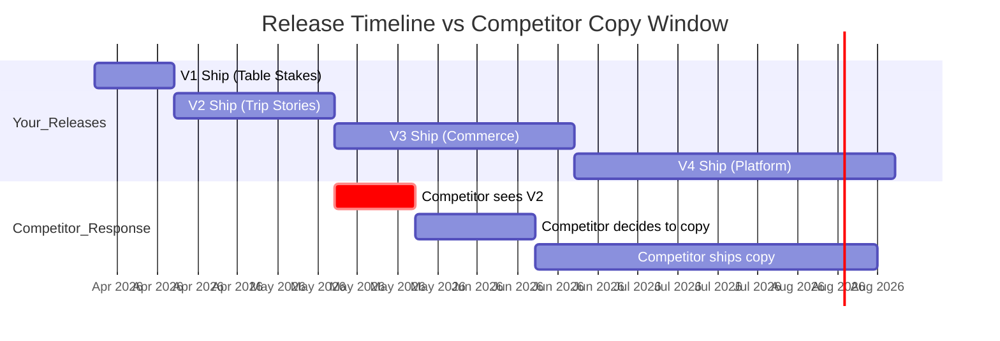
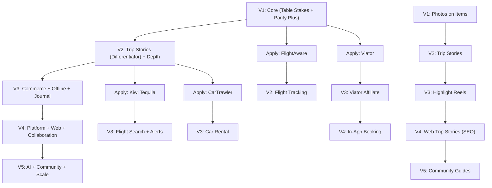

# Travel Planner — Feature Roadmap & Competitive Strategy

> **Overview:** Complete feature roadmap with competitive release strategy. Features categorized as Table Stakes (ship quietly), Parity Plus (ship with better execution), and Differentiators (ship with noise). V1 ships in 2 weeks. V2 ships Trip Stories as the brand-defining feature 4 weeks later. V3+ adds commerce. Each release is timed to stay one version ahead of competitors.

## Implementation checklist

- [ ] **v1-ship** — V1 (2 weeks): Table stakes + parity plus. Ship to stores. Market the VISION, not features. Apply for FlightAware + Viator during sprint.
- [ ] **v1-launch-marketing** — V1 Launch: Product Hunt launch, ASO optimization, travel subreddits, 'built by frustrated travelers' narrative. No feature-by-feature marketing.
- [ ] **v2-trip-stories** — V2 (4 weeks after V1): Ship Trip Stories as BRAND-DEFINING differentiator. Marketing blitz: demo videos, influencer partnerships, 'share your adventures' campaign. Every shared card = free billboard.
- [ ] **partner-applications** — Apply for FlightAware (V1 sprint), Viator (end of V1), Kiwi Tequila (V2 sprint), CarTrawler (V2 sprint), Mapbox (V2 sprint)
- [ ] **v3-monetize** — V3 (Months 2-4): Affiliate commerce (Viator, flights, car rental, hotels). Cheap flight alerts. Partial offline. Journal. First revenue.
- [ ] **v4-platform** — V4 (Months 4-8): In-app booking, Next.js web app (SEO + shareable Trip Stories as web pages), collaboration, full offline.
- [ ] **v5-scale** — V5 (Months 8-12): AI planner, community guides, widgets, multi-currency, insurance.

---

## Competitive Release Strategy

### The Three Feature Categories

Every feature falls into one of three categories. This determines HOW you build it and HOW you market it.

**Table Stakes (50% of features)** — Every travel app has these. Users expect them. Not having them is a dealbreaker, but having them earns zero credit. Ship quietly. Never market these individually.

**Parity Plus (30% of features)** — Competitors have the concept, but you execute it noticeably better. Same idea, superior experience. Market the EXPERIENCE ("we reimagined trip planning"), never the feature name ("we have a timeline like TripIt").

**Differentiators (20% of features)** — No competitor has these, or you approach them in a fundamentally different way. These define your brand. Market aggressively. Own the narrative publicly.

### Five Rules for Competing with Larger Players

**1. Never hold back features.** Speed is your only structural advantage. TripIt is owned by SAP/Concur — they move at enterprise speed. Ship everything as fast as possible.

**2. Build moats, not just features.** Features are copied in weeks. Moats take years.

| Moat Type    | How You Build It                                                                                                                 | When      |
| ------------ | -------------------------------------------------------------------------------------------------------------------------------- | --------- |
| Content moat | Trip Stories create user-generated shareable content. Community guides compound over time.                                       | V2 onward |
| Data moat    | Every trip, booking, and flight tracked = data for better AI recommendations.                                                    | V3 onward |
| Network moat | Every shared Trip Story brings the sharer's friends to the app. Social sharing IS the growth engine.                             | V2 onward |
| Brand moat   | Consistent design quality. "That travel app with the beautiful sharing." Competitors can copy features but not brand perception. | V1 onward |

**3. Own the narrative publicly.** Date-stamped blog posts, App Store release notes, social media announcements for every release. If a competitor copies Trip Stories 6 months later, your public paper trail proves you had it first.

**4. Iterate faster than they can copy.** Target release cadence:

- V1 → V2: 4 weeks

- V2 → V3: 6 weeks

- V3 → V4: 8 weeks

By the time a competitor decides to copy your V2 feature (2-3 months in a large org), you're on V3. Always one version ahead.

**5. Compete on the combination.** No single feature is defensible. But this specific combination is extremely hard to replicate: *collapsible timeline + speed dial FAB + AI email parsing + Trip Stories social sharing + affiliate commerce + polished native iOS design with SF Pro Rounded and SwiftUI animations.* A competitor would have to redesign their entire app. They won't. They'll bolt one feature on — and it will feel worse than your native Swift implementation.

### Marketing Strategy Per Release

| Release | What You Market                                                                                                                                                                     | Channel                                                                              | Tone                         |
| ------- | ----------------------------------------------------------------------------------------------------------------------------------------------------------------------------------- | ------------------------------------------------------------------------------------ | ---------------------------- |
| V1      | The **vision**: "The only travel app you'll ever need." Not features — the story. "Built by travelers frustrated with 10 apps for one trip."                                        | Product Hunt, travel subreddits, App Store ASO, Twitter/X                            | Founder story, authenticity  |
| V2      | **Trip Stories** as the defining feature. Demo videos of sharing beautiful cards. "Share your adventures, not just screenshots." Make Trip Stories synonymous with your brand name. | Instagram/TikTok (travel creators), influencer partnerships, App Store feature pitch | Aspirational, visual, social |
| V3      | "Plan AND book in one app." Affiliate commerce is the hook. "Found a cheaper flight? We'll alert you."                                                                              | Content marketing (SEO blog posts: "best flights to X"), travel deal communities     | Practical, deal-savvy        |
| V4      | "Plan together." Collaboration story. Web companion enables desktop planning + SEO acquisition. Shared Trip Stories become indexable web pages.                                     | Google organic (SEO), partnerships, press                                            | Professional, platform       |

---

## V1 — Launch (2 Weeks)

**Marketing approach**: Market the vision, not features. "The only travel app you need."

| #   | Feature                                                                       | Category       | Complexity |
| --- | ----------------------------------------------------------------------------- | -------------- | ---------- |
| 1   | Email sign-up / sign-in                                                       | Table Stakes   | Low        |
| 2   | Sign in with Apple + Google                                                   | Table Stakes   | Low        |
| 3   | Create trip (destination autocomplete, dates, auto-title, auto-generate days) | Table Stakes   | Medium     |
| 4   | Edit trip (title, destination, dates with cascading, cover photo, notes)      | Table Stakes   | Medium     |
| 5   | Delete trip (swipe + undo)                                                    | Table Stakes   | Low        |
| 6   | Trips list: Active hero, Upcoming, Past (collapsed)                           | Parity Plus    | Medium     |
| 7   | Search + sort trips                                                           | Table Stakes   | Low        |
| 8   | Cover photo or gradient placeholder                                           | Parity Plus    | Low        |
| 9   | Continuous vertical timeline (rail, dots, connectors)                         | Parity Plus    | High       |
| 10  | Collapsible day sections with sticky headers                                  | Parity Plus    | High       |
| 11  | Smart collapse defaults + Expand/Collapse All                                 | Parity Plus    | Low        |
| 12  | NOW indicator + auto-scroll to today                                          | Parity Plus    | Medium     |
| 13  | Quick-access pills row (Map, Bookings, Files active; others "Coming Soon")    | Parity Plus    | Medium     |
| 14  | Speed Dial FAB (Add Place, Add Booking)                                       | Parity Plus    | Medium     |
| 15  | Add Place modal (search + wishlist, single purpose)                           | Table Stakes   | Medium     |
| 16  | Ideas/Wishlist (unscheduled places, assign to day)                            | Parity Plus    | Medium     |
| 17  | Add Booking modal (6 type-specific forms)                                     | Table Stakes   | High       |
| 18  | Booking cards on timeline (type-colored, type-specific layouts)               | Parity Plus    | Medium     |
| 19  | Ongoing booking banners (multi-day hotels/car rentals)                        | Parity Plus    | Medium     |
| 20  | Bookings screen (grouped by type)                                             | Table Stakes   | Medium     |
| 21  | Email forwarding + AI parsed booking review                                   | Differentiator | Medium     |
| 22  | Realtime updates for parsed bookings                                          | Differentiator | Medium     |
| 23  | Attach photos to places/bookings                                              | Table Stakes   | Medium     |
| 24  | File uploads for trips (PDFs, tickets, insurance)                             | Table Stakes   | Low        |
| 25  | Map view with route polylines                                                 | Parity Plus    | High       |
| 26  | Move place/booking between days                                               | Table Stakes   | Low        |
| 27  | Drag-and-drop reorder                                                         | Table Stakes   | Medium     |
| 28  | Time gap indicators                                                           | Parity Plus    | Low        |
| 29  | Push notifications (booking parsed, trip tomorrow)                            | Table Stakes   | Medium     |
| 30  | Profile/Settings                                                              | Table Stakes   | Low        |
| 31  | Dark mode                                                                     | Table Stakes   | Low        |
| 32  | Haptic feedback                                                               | Parity Plus    | Low        |

**V1 feature breakdown**: 16 Table Stakes, 14 Parity Plus, 2 Differentiators.

The 2 differentiators in V1 (AI booking parsing + realtime updates) are worth mentioning in launch messaging but should not be the primary marketing angle. Save the big marketing push for V2.

---

## V2 — Trip Stories + Depth (4 Weeks After V1)

**Marketing approach**: BRAND-DEFINING RELEASE. Every piece of marketing centers on Trip Stories. This is your "Instagram Stories moment." Demo videos, influencer partnerships, social campaigns.

**Tagline**: "Share your adventures, not just screenshots."

| #   | Feature                               | Category           | Complexity | Description                                                                                                                                                                                               |
| --- | ------------------------------------- | ------------------ | ---------- | --------------------------------------------------------------------------------------------------------------------------------------------------------------------------------------------------------- |
| 1   | **Trip Stories — Share a Place Card** | **Differentiator** | Medium     | Timeline card → "Share" → pick photo → add reaction → generates branded image card. Share to Instagram/WhatsApp/iMessage. Formats: 9:16 Stories, 1:1 Feed. Every shared card is a billboard for your app. |
| 2   | **Trip Stories — Share a Day Story**  | **Differentiator** | High       | Day header → "Share This Day" → multi-card story with all places, photos, reactions, mini route map. Generates tall image or multi-page carousel. The visual crown jewel.                                 |
| 3   | **Share Composer**                    | **Differentiator** | Medium     | Preview, edit reactions per place, choose photos, toggle format/branding, generate + share. Beautiful, polished creation experience.                                                                      |
| 4   | **Flight tracking**                   | Parity Plus        | Medium     | Real-time status via FlightAware. Status badges on cards: "On Time", "Delayed 45m", "Gate Changed". Push on status change.                                                                                |
| 5   | **Checklist screen**                  | Table Stakes       | Medium     | Packing + to-do with categories and checkboxes. Pill badge "3/12". Speed dial: "Add To-do".                                                                                                               |
| 6   | **Notes screen**                      | Table Stakes       | Low        | Note cards. CRUD. Pill badge count. Speed dial: "Add Note".                                                                                                                                               |
| 7   | **Budget screen**                     | Table Stakes       | Medium     | Total budget, expenses with category + receipt photo, progress bar, breakdown. Pill badge "$2.4K". Speed dial: "Add Expense".                                                                             |
| 8   | **Onboarding carousel**               | Table Stakes       | Low        | 3-screen intro + sample trip on first launch.                                                                                                                                                             |
| 9   | **Trip sharing (read-only link)**     | Parity Plus        | Medium     | Public URL to view trip timeline without signing in. Simple Supabase public view.                                                                                                                         |
| 10  | **Explore nearby on map**             | Parity Plus        | Medium     | Toggle POI overlay near destination. Tap to add.                                                                                                                                                          |

**V2 is the growth inflection point.** Trip Stories drive organic acquisition: User shares Day Story on Instagram → followers see beautiful branded card with app name → download app → plan their trip → share their Trip Stories → cycle repeats.

---

## V3 — Commerce + Offline (6 Weeks After V2, ~Months 2-4)

**Marketing approach**: "Plan AND book in one app." First affiliate revenue. Cheap flight alerts as acquisition hook.

| #   | Feature                         | Category           | Complexity | Description                                                                                                                                    |
| --- | ------------------------------- | ------------------ | ---------- | ---------------------------------------------------------------------------------------------------------------------------------------------- |
| 1   | **Tours & activities (Viator)** | Differentiator     | High       | Browse 300K+ tours by destination. **3a**: Affiliate link (8% commission). **3b**: In-app booking post-certification.                          |
| 2   | **Car rental search**           | Parity Plus        | High       | CarTrawler/[Booking.com](https://www.booking.com) API. **3a**: Affiliate link. **3b**: In-app booking post-approval.                                                      |
| 3   | **Flight search**               | Parity Plus        | High       | Kiwi Tequila API. **3a**: Affiliate link. **3b**: In-app booking.                                                                              |
| 4   | **Hotel search**                | Parity Plus        | High       | [Booking.com](https://www.booking.com) affiliate API. **3a**: Affiliate. **3b**: In-app.                                                                                  |
| 5   | **Cheap flight alerts**         | **Differentiator** | High       | Set route + dates to watch. Backend cron polls Kiwi. Push on price drop. "Book Now" CTA. *This is both a retention tool and a marketing hook.* |
| 6   | **Offline support (partial)**   | Parity Plus        | High       | SwiftData local cache. View itinerary/bookings offline. Queued mutations. MapKit offline tiles.                                                |
| 7   | **Journal**                     | Table Stakes       | Medium     | Grouped by day. Prompts, mood, place linking, photos.                                                                                          |
| 8   | **Data export**                 | Table Stakes       | Low        | PDF itinerary or JSON backup.                                                                                                                  |
| 9   | **Trip Highlight Reel**         | **Differentiator** | High       | Pick best moments across entire trip → curated multi-day shareable story. Social sharing V2.                                                   |

**Revenue starts here.** Affiliate commissions from Viator (8%), flight/hotel/car bookings. Cheap flight alerts drive daily app opens (retention) and word-of-mouth ("this app told me about a $200 flight to Paris!").

---

## V4 — Platform (8 Weeks After V3, ~Months 4-8)

**Marketing approach**: "Plan together, book together, share together." Web app enables SEO acquisition. Trip Stories become indexable web pages.

| #   | Feature                       | Category           | Complexity | Description                                                                                                                                                      |
| --- | ----------------------------- | ------------------ | ---------- | ---------------------------------------------------------------------------------------------------------------------------------------------------------------- |
| 1   | **In-app Viator booking**     | Differentiator     | High       | Full booking flow post-certification. Auto-adds to timeline.                                                                                                     |
| 2   | **In-app car rental booking** | Parity Plus        | High       | Full search/compare/book via CarTrawler.                                                                                                                         |
| 3   | **In-app flight booking**     | Parity Plus        | Very High  | Full flow via Kiwi/Amadeus. Ticketing, cancellations, support.                                                                                                   |
| 4   | **Web companion app**         | Table Stakes       | High       | Separate web project for SEO. Desktop planning. Shareable URLs indexed by Google.                                                                                |
| 5   | **Trip Stories as web pages** | **Differentiator** | Medium     | Shared cards/stories become public, SEO-friendly web pages. Rich Open Graph for Instagram/WhatsApp previews. This is where social sharing becomes an SEO engine. |
| 6   | **Real-time collaboration**   | Parity Plus        | High       | Multi-user editing. Supabase Realtime. Invite via email/ShareLink. Editor/viewer.                                                                                |
| 7   | **Expense splitting**         | Parity Plus        | Medium     | Split between travelers. Settlement summary.                                                                                                                     |
| 8   | **Full offline support**      | Parity Plus        | Very High  | SwiftData, bidirectional sync, conflict resolution, MapKit offline tiles.                                                                                        |

**Revenue scales here.** In-app booking commissions (higher margin than affiliate links). Web app drives free organic traffic via SEO. Consider Pro subscription for offline + advanced features.

---

## V5 — Scale (Months 8-12+)

**Marketing approach**: Platform story. "The travel platform."

| #   | Feature                     | Category           | Complexity | Description                                                                     |
| --- | --------------------------- | ------------------ | ---------- | ------------------------------------------------------------------------------- |
| 1   | **WidgetKit Widgets**       | Parity Plus        | Medium     | Today's itinerary, flight status, countdown. Lock Screen + Home Screen widgets. |
| 2   | **Apple Watch App**         | Differentiator     | High       | Boarding pass, next item, flight status. WatchKit + HealthKit step tracking.    |
| 3   | **AI trip planner**         | **Differentiator** | High       | "Plan 5 days in Tokyo" → AI-generated itinerary.                                |
| 4   | **Community travel guides** | **Differentiator** | Medium     | Publish trips as guides. Browse by destination. "Clone trip." Content moat.     |
| 5   | **Loyalty integration**     | Parity Plus        | High       | Airline/hotel points. Redemption suggestions.                                   |
| 6   | **Multi-currency**          | Parity Plus        | Medium     | Budget in multiple currencies. Live rates.                                      |
| 7   | **Travel insurance**        | Table Stakes       | Medium     | Partner integration during trip creation.                                       |
| 8   | **Live Activities**         | Differentiator     | Medium     | Real-time flight tracking on Lock Screen + Dynamic Island via ActivityKit.      |

---

## Differentiator Timeline — Your Competitive Edge

These are the features NO competitor has (or that you do fundamentally better). Protect them with public timestamps.

```mermaid
graph LR
  subgraph v1Sprint [V1 - Week 1-2]
    AIparsing["AI Booking Parser + Realtime"]
  end
  subgraph v2Sprint [V2 - Week 3-6]
    PlaceCard["Trip Stories: Place Cards"]
    DayStory["Trip Stories: Day Stories"]
    Composer["Share Composer"]
  end
  subgraph v3Sprint [V3 - Month 2-4]
    Highlight["Trip Highlight Reels"]
    FlightAlerts["Cheap Flight Alerts"]
    ViatorAffiliate["Viator Discovery"]
  end
  subgraph v4Sprint [V4 - Month 4-8]
    WebStories["Trip Stories as Web Pages (SEO)"]
    InAppBooking["In-App Viator Booking"]
  end
  subgraph v5Sprint [V5 - Month 8-12]
    AIplanner["AI Trip Planner"]
    Community["Community Guides"]
    Watch["Apple Watch App"]
  end
  v1Sprint --> v2Sprint
  v2Sprint --> v3Sprint
  v3Sprint --> v4Sprint
  v4Sprint --> v5Sprint
```



**Your differentiator moat deepens over time:**

- V1: AI parsing (defensible via quality + speed)

- V2: Trip Stories (defensible via brand association + content moat)

- V3: Flight alerts + Viator discovery (defensible via partner relationships + data)

- V4: Web Trip Stories as SEO pages (defensible via indexed content volume)

- V5: AI planner + community guides (defensible via accumulated data + user-generated content)

Each layer builds on the previous. A competitor copying Trip Stories at V2 still can't replicate the V3 commerce layer or the V4 SEO content engine or the V5 AI trained on your data.

---

## Social Sharing — Detailed Design

### Share a Place Card (V2)

User flow: Timeline card → context menu → "Share" → Share Composer

```
  ┌─────────────────────────────────┐
  │  Share                      ✕   │
  ├─────────────────────────────────┤
  │                                 │
  │  ┌─ Preview ─────────────────┐  │
  │  │                           │  │
  │  │  🖼️ [Place photo]         │  │
  │  │                           │  │
  │  │  ⭐ Eiffel Tower          │  │
  │  │  Paris · March 13         │  │
  │  │  Trip to Paris            │  │
  │  │                           │  │
  │  │  "Breathtaking views      │  │
  │  │   from the top!"          │  │
  │  │                           │  │
  │  │         yourapp.com       │  │
  │  └───────────────────────────┘  │
  │                                 │
  │  📸 Photo         [Change]      │
  │                                 │
  │  ✏️ Reaction                     │
  │  "Breathtaking views from the   │
  │   top!"                         │
  │                                 │
  │  Format                         │
  │  ◉ Story (9:16)  ○ Square (1:1) │
  │                                 │
  │  ☑ Include app branding         │
  │  ☑ Include trip name            │
  │                                 │
  │  [ Share → ]                    │
  └─────────────────────────────────┘
```

### Share a Day Story (V2)

```
  ┌─────────────────────────────────┐
  │  Share Day 2              ✕     │
  ├─────────────────────────────────┤
  │                                 │
  │  ┌─ Story Preview ───────────┐  │
  │  │  Day 2 — March 13         │  │
  │  │  Trip to Paris             │  │
  │  │                           │  │
  │  │  🖼️ [Photo]               │  │
  │  │  ⭐ Eiffel Tower          │  │
  │  │  9:00 AM                  │  │
  │  │  "Breathtaking!" ✏️       │  │
  │  │        ↓                  │  │
  │  │  🖼️ [Photo]               │  │
  │  │  🍴 Le Petit Cler         │  │
  │  │  12:15 PM                 │  │
  │  │  "Best croissants" ✏️     │  │
  │  │        ↓                  │  │
  │  │  🖼️ [Photo]               │  │
  │  │  🏛️ Louvre                │  │
  │  │  2:30 PM                  │  │
  │  │  "Mind blown" ✏️          │  │
  │  │                           │  │
  │  │  🗺️ [Mini route map]      │  │
  │  │         yourapp.com       │  │
  │  └───────────────────────────┘  │
  │                                 │
  │  ☑ Include route map            │
  │  ☑ Include app branding         │
  │                                 │
  │  Places to include:             │
  │  ☑ ⭐ Eiffel Tower              │
  │  ☑ 🍴 Le Petit Cler             │
  │  ☑ 🏛️ Louvre                    │
  │  ☐ 🏨 Le Marais Hotel           │
  │                                 │
  │  [ Share → ]                    │
  └─────────────────────────────────┘
```

### Trip Highlight Reel (V3)

Pick best moments across entire trip → curated multi-day shareable story.

### Trip Stories as Web Pages (V4)

Shared content becomes public, SEO-friendly web pages with rich Open Graph previews. Instagram link-in-bio shows a beautiful web version. Google indexes it. Social sharing becomes an SEO acquisition engine.

---

## Revenue Model

| Version | Revenue                                                                                         | Growth Engine                                                       |
| ------- | ----------------------------------------------------------------------------------------------- | ------------------------------------------------------------------- |
| V1      | Free                                                                                            | App Store ASO, Product Hunt, travel communities, founder story      |
| V2      | Free                                                                                            | **Trip Stories = viral loop.** Every shared card is free marketing. |
| V3      | Affiliate commissions (Viator 8%, flights, hotels, car) + cheap flight alerts as retention hook | Content marketing, SEO blog, deal communities                       |
| V4      | In-app booking commissions (higher margin) + Pro subscription ($4.99/mo for offline + advanced) | Google organic (web companion SEO), Trip Stories web pages indexed  |
| V5      | Premium subscription + sponsored placements + insurance commissions                             | AI planner virality, community content                              |

---

## Partner Application Timeline

Start applications EARLY. Approval takes weeks.

| Partner                     | Apply During | Needed For                       | Lead Time               |
| --------------------------- | ------------ | -------------------------------- | ----------------------- |
| FlightAware / AviationStack | V1 sprint    | V2 flight tracking               | Days (free tier)        |
| Viator Partner API          | End of V1    | V3 affiliate → V4 in-app booking | 2-4 weeks certification |
| Kiwi Tequila API            | V2 sprint    | V3 flight search + alerts        | 1-2 weeks review        |
| CarTrawler / [Booking.com](https://www.booking.com)    | V2 sprint    | V3 car rental + hotel            | Weeks (varies)          |
| MapKit (Apple)              | Built-in     | V3 offline map tiles via MapKit  | None (native framework) |

---

## Release Cadence & Competitive Pacing



By the time a competitor ships their copy of Trip Stories (~3-4 months after your V2), you're already on V4 with web-based Trip Stories as SEO pages, in-app booking, and collaboration. They're perpetually one version behind.

---

## Dependency Graph



