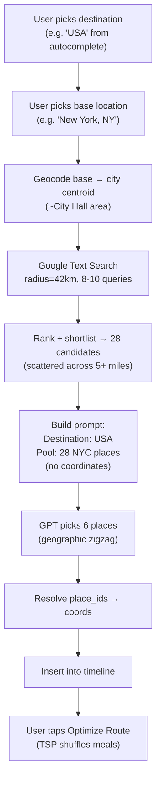
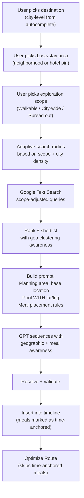

# Itinerary Generation Pipeline Redesign

## Current Flow (What Breaks)



**Five root causes:**

1. Prompt says `Destination: USA` but pool is NYC places (abstraction mismatch)
2. 42km radius from city centroid produces geographically scattered pool
3. Model never sees lat/lng — cannot reason about walkability or proximity
4. Meals are flat pool items that get shuffled by TSP optimization
5. No signal about geographic scope (walkable neighborhood vs city-wide exploration)

## Proposed Flow (After Changes)



---

## Change 1: Use Base Location as Planning Destination in Prompt

**Files:** `itinerary-ai/index.ts` (system prompt assembly, ~line 1720-1822 in codepath.txt)

**Problem:** The prompt sends `Destination: USA` from `trip.destination` while the pool is anchored to the base location. The model has no strong geographic anchor.

**Fix:** When building the system prompt for `plan_day` / `plan_trip`, replace the trip-level destination with the base location label in key planning context:

- Change `Destination: ${tripDestinations[0]?.label}` to use the `stay_area_label` when available
- Change the `DAY -> DESTINATION` mapping (line ~1711-1718) to show the base location label, not the trip destination
- Add a new line: `Planning area center: ${stay_area_label}` in the `preferenceSection`

**Before:**

```
Destination: USA
2026-04-15 → USA
Base area for POI search: New York, New York, NY, USA
```

**After:**

```
Destination: New York, New York, NY, USA
2026-04-15 → New York, New York, NY, USA
```

The trip-level destination ("USA") stays in the DB and UI. Only the prompt changes.

---

## Change 2: Add Lat/Lng to Candidate Pool Prompt

**File:** `day_plan_candidate_pipeline.ts` — `formatCandidatePoolForPrompt` function (line ~3271-3298 in codepath.txt)

**Problem:** The model sees `name`, `place_id`, `address`, `types` but never coordinates. It cannot do spatial reasoning.

**Fix:** Add `lat` and `lng` fields to the JSON lines emitted for each candidate. Also add a `dist_km` field showing distance from the center point.

**Current output per candidate:**

```json
{"rank":1,"place_id":"ChIJ...","name":"Central Park","wayfind_category":"nature","types":[...],"address":"...","rank_score":0.636}
```

**New output per candidate:**

```json
{"rank":1,"place_id":"ChIJ...","name":"Central Park","lat":40.783,"lng":-73.965,"dist_km":7.2,"wayfind_category":"nature","types":[...],"address":"...","rank_score":0.636}
```

This requires:

- Passing the `center` coordinates into `formatCandidatePoolForPrompt`
- Computing `haversineKm(center, candidate)` for each candidate
- Rounding lat/lng to 3 decimals (sufficient precision, saves tokens)

Also add a note to the system prompt:

```
Pool entries include lat, lng, and dist_km (distance from your base/stay area).
Use these to ensure geographically coherent sequencing. Prefer clusters of nearby stops.
Stops beyond 5km from the base should only be included if they are genuinely worth the travel time.
```

---

## Change 3: Add Exploration Scope Selector (New User Input)

**Files:**

- Frontend: New UI component in the AI planner input sheet (selection chips)
- Backend: `itinerary-ai/index.ts` — new `exploration_scope` field in `RequestBody`
- Backend: `day_plan_candidate_pipeline.ts` — dynamic radius based on scope
- Backend: `v2b_ai_constants.ts` — scope definitions

**New user input (selection chips, no typing):**

| Scope        | Label                   | Search Radius | Prompt Hint                                                                      |
| ------------ | ----------------------- | ------------- | -------------------------------------------------------------------------------- |
| `walkable`   | "Walkable neighborhood" | 3-5 km        | All stops should be walk-connected (under 20 min walk between consecutive stops) |
| `city_wide`  | "Explore the city"      | 15-25 km      | Mix of neighborhoods, transit hops OK                                            |
| `spread_out` | "Spread out / driving"  | 40-80 km      | Longer distances expected, driving/transit between areas                         |

**Implementation:**

- Add `exploration_scope?: "walkable" | "city_wide" | "spread_out"` to `RequestBody` (default: `city_wide`)
- Replace the hardcoded `DEFAULT_SEARCH_RADIUS_M = 42_000` with a function:

```typescript
function searchRadiusForScope(scope: string): number {
  switch (scope) {
    case "walkable":
      return 4_000; // 4km
    case "city_wide":
      return 20_000; // 20km
    case "spread_out":
      return 60_000; // 60km
    default:
      return 20_000;
  }
}
```

- Add the scope to the system prompt's `preferenceSection` so the model adjusts pacing
- Modify `buildSearchSpecs` to adjust query phrasing per scope (e.g., `walkable` uses "near [base]" instead of "in [city]")

**For the Bali problem (sparse destinations):** When `spread_out` is selected, the search queries should use broader terms and the model should be instructed that transit between stops is expected and should be noted in descriptions.

---

## Change 4: Two-Pass Meal Integration

**File:** `itinerary-ai/index.ts` — prompt construction (system prompt CORE PLANNING RULES and PACING RULES sections)

**Problem:** Meals and activities compete in the same flat pool. The model picks meals from geographically random pool entries. Then TSP optimization shuffles them out of time order.

**Fix — two parts:**

### Part A: Prompt-level meal placement rules (in system prompt)

Add a new section to the system prompt between ROUTE REALISM and STORY WRITING RULES:

```
## MEAL PLACEMENT (HARD)
- Meals are GEOGRAPHIC CONNECTORS, not standalone destinations.
- Lunch must be within 1km walking distance of BOTH the preceding and following activity.
  Pick from the pool based on proximity to where the day naturally pauses, not based on restaurant fame.
- Dinner / evening meal should be near the last 1-2 activities of the day.
- Never place a meal that requires a long transit from the previous stop.
- Use the lat/lng in the pool to verify proximity before selecting a meal venue.
- Mark every meal activity with a "meal_anchor": true field in the output JSON.
```

Add `meal_anchor` to the response schema:

```
- "meal_anchor" (boolean, optional): true for meal stops that should not be reordered by route optimization.
```

### Part B: On-device TSP respects meal anchors

**File:** `utils/routeOptimizer.ts` (referenced in Technical Spec)

Modify `optimizeRoute` to treat activities with `meal_anchor: true` (or category `restaurant` with specific time ranges) as **locked** — same as activities with `starts_at !== null`. The TSP only reorders flexible non-meal activities between the fixed meal time slots.

Current logic already has:

```typescript
const locked = activities.filter((a) => a.starts_at !== null);
const flexible = activities.filter((a) => a.starts_at === null);
```

Extend the locked filter:

```typescript
const locked = activities.filter(
  (a) => a.starts_at !== null || a.meal_anchor === true,
);
const flexible = activities.filter(
  (a) => a.starts_at === null && !a.meal_anchor,
);
```

This means:

- Morning activities: optimizable
- Lunch: locked at its time slot
- Afternoon activities: optimizable
- Dinner: locked at its time slot

Result: 2-3 activities between each meal are optimized for route, but meals stay in their logical position.

---

## Change 5: Adaptive Search Radius + Smarter Search Queries

**File:** `day_plan_candidate_pipeline.ts` — `buildSearchSpecs` and `fetchPlanDayCandidatePool`

**Problem:** `buildSearchSpecs` uses generic "top tourist attractions in {city}" queries with a 42km radius. This produces:

- Famous landmarks far from the base (Central Park when centered on FiDi)
- Generic "top 10" results instead of neighborhood-specific gems
- Same query style for dense cities (NYC) and sparse destinations (Bali)

**Fix:**

### A) Scope-aware query phrasing

```typescript
function buildSearchSpecs(
  destinationLabel: string,
  baseLabelOrNeighborhood: string,
  includeMeals: boolean,
  scope: "walkable" | "city_wide" | "spread_out",
): SearchSpec[] {
  const d = destinationLabel.trim();
  const base = baseLabelOrNeighborhood.trim();

  if (scope === "walkable") {
    // Neighborhood-focused queries
    return [
      { textQuery: `things to do near ${base}` },
      { textQuery: `attractions and landmarks near ${base}` },
      { textQuery: `parks and gardens near ${base}`, includedType: "park" },
      { textQuery: `art galleries near ${base}`, includedType: "art_gallery" },
      { textQuery: `interesting places to visit near ${base}` },
      ...(includeMeals
        ? [
            {
              textQuery: `best restaurants near ${base}`,
              includedType: "restaurant",
            },
            { textQuery: `cafes near ${base}`, includedType: "cafe" },
          ]
        : []),
    ];
  }

  // city_wide / spread_out — keep current "in {city}" queries
  // but add "near {base}" queries too for local flavor
  return [
    { textQuery: `top attractions and landmarks in ${d}` },
    { textQuery: `popular things to do in ${d}` },
    { textQuery: `interesting places near ${base}` },
    { textQuery: `museums and cultural sites in ${d}`, includedType: "museum" },
    { textQuery: `parks and nature in ${d}`, includedType: "park" },
    ...(includeMeals
      ? [
          { textQuery: `restaurants near ${base}`, includedType: "restaurant" },
          {
            textQuery: `popular restaurants in ${d}`,
            includedType: "restaurant",
          },
        ]
      : []),
  ];
}
```

Key change: **meal queries always use "near {base}"** regardless of scope. This ensures restaurants are geographically relevant to where the user is staying, even when attractions span the city.

### B) Post-search geographic filter

After ranking, add a distance cap based on scope:

```typescript
const MAX_DIST_KM: Record<string, number> = {
  walkable: 5,
  city_wide: 25,
  spread_out: 80,
};
```

Filter out candidates beyond the distance cap before shortlisting. This prevents Central Park from appearing in a FiDi-centered walkable day.

### C) Separate meal pool from activity pool

Instead of mixing meals and activities in one pool, fetch them separately and present them separately in the prompt:

```
## ACTIVITY CANDIDATES (New York, NY — walkable scope)
{"rank":1, "name":"Museum at Eldridge Street", "lat":40.715, "lng":-73.992, "dist_km":0.8, ...}
...

## MEAL CANDIDATES (near base area)
{"rank":1, "name":"Gran Morsi", "lat":40.714, "lng":-74.008, "dist_km":0.3, ...}
...
```

This makes it explicit to the model: pick activities from one pool, meals from the other. Meals are always near the base, activities vary by scope.

---

## Summary of All Changes

| Change                                       | Files                                                  | Effort                                   | Impact                                       |
| -------------------------------------------- | ------------------------------------------------------ | ---------------------------------------- | -------------------------------------------- |
| 1. Use base location as planning destination | `itinerary-ai/index.ts`                                | Small (prompt string changes)            | High — fixes model confusion                 |
| 2. Add lat/lng to candidate pool             | `day_plan_candidate_pipeline.ts`                       | Small (add fields to JSON output)        | High — enables geographic reasoning          |
| 3. Exploration scope selector                | Frontend + `itinerary-ai/index.ts` + pipeline          | Medium (new input + radius logic)        | Very High — fixes scatter for all city types |
| 4. Two-pass meal integration                 | `itinerary-ai/index.ts` (prompt) + `routeOptimizer.ts` | Medium (prompt rules + optimizer change) | High — fixes meal shuffling                  |
| 5. Adaptive search queries + distance cap    | `day_plan_candidate_pipeline.ts`                       | Medium (query rewrite + filter)          | Very High — fixes pool quality at source     |

**Recommended implementation order:** 1 → 2 → 5 → 4 → 3 (quick wins first, then the new user input last since it requires frontend work)

---

## Expected Output After All Changes

For the same "Trip to USA, base: New York, NY" scenario with walkable scope:

```
Planning area: New York, NY (Lower Manhattan)
Scope: Walkable neighborhood (stops within 5km of base)

Pool: 28 places all within 3km of City Hall
- No Central Park (7km away, filtered out)
- Clustered: Tribeca, FiDi, LES, Chinatown, SoHo
- Meals: restaurants within 1km of base

Generated itinerary:
09:00  City Hall Park (0.1km from base) — morning walk
10:00  Museum at Eldridge Street (0.8km) — culture
12:00  Gran Morsi (0.3km, near both neighbors) — lunch [meal_anchor]
13:30  Mercer Labs (0.4km) — afternoon art
15:00  Little Island (1.2km) — nature/scenic
16:30  Chambers wine bar (0.2km) — wind-down
```

All stops within walking distance, meals geographically anchored, no 5-mile zigzags.
